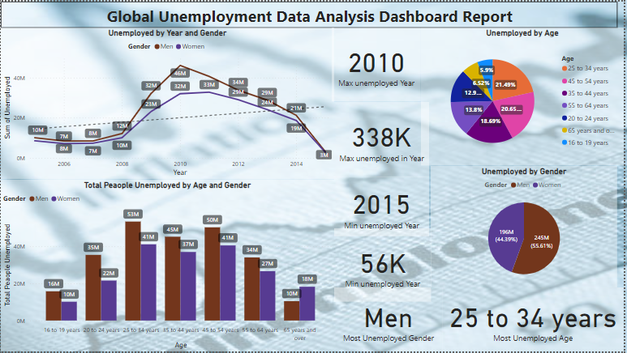

## **Global Unemployment Data analytics - Power BI Project**

# 🌐 Overview:
-Welcome to the Global Unemployment Data analytics Power BI Dashboard project! This repository contains a Power BI project focused on analyzing Global Unemployment data.

# Global Unemployment Data Analytics Project

## Overview
Welcome to the Global Unemployment Data Analytics project! This repository hosts an interactive Power BI dashboard analyzing global unemployment trends across multiple years, with a specific focus on gender disparities. Gain comprehensive insights into the complexities of the global workforce through detailed visualizations and actionable data.

## Highlights
- **Visualizations:** Interactive graphs depicting global unemployment trends.
- **Gender Analysis:** In-depth exploration of unemployment data by gender across multiple years.
- **Actionable Insights:** Utilize the dashboard to understand and address diverse workforce challenges.

## Getting Started
1. Clone or download the repository.
2. Open the Power BI file using Power BI Desktop.
3. Explore the dashboard to visualize global unemployment data by gender across different years.
4. Customize the dashboard or contribute to the project by providing feedback or enhancements.

## How to Contribute
Your contributions are welcome! If you have ideas for improvements, additional features, or find any issues, feel free to:
- Fork the repository
- Create a new branch
- Make your changes
- Submit a pull request

## License
This project is licensed under [insert license type here]. Refer to the LICENSE file for more details.

## Contact
For inquiries or collaboration, please contact [Your Name] at [Your Email Address].

Enjoy exploring global unemployment data analytics! 🌐📊

